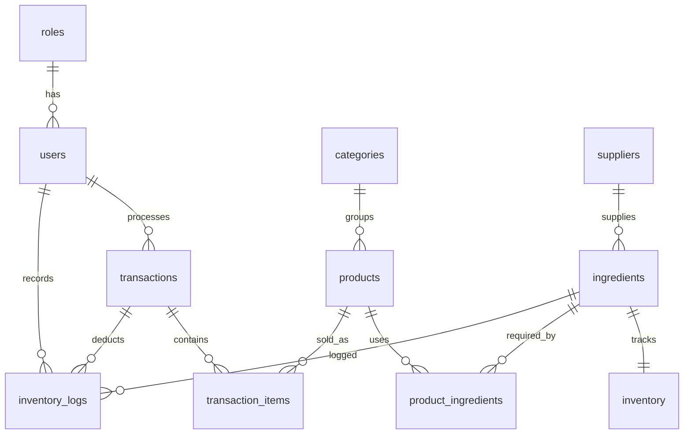

# Coffee Shop POS-IMS Implementation Guide

## Project Structure

```text
src/coffeeshopkiosk/
  CoffeeShopKiosk.java          Main JavaFX application entry point
  AppNavigator.java             Shared scene/view navigation helper
  controller/                   FXML controllers
  dao/                          JDBC CRUD and report classes
  database/                     Database connection helper
  model/                        OOP data models
  util/                         Session, validation, receipt, password helpers
  view/                         Scene Builder compatible FXML files
  css/                          JavaFX stylesheet
database/
  schema.sql                    PostgreSQL table creation script
  sample_data.sql               Demo data
lib/
  postgresql-42.7.7.jar         PostgreSQL JDBC driver used by NetBeans
```

## PostgreSQL Setup

1. Install PostgreSQL and remember your `postgres` password.
2. Open pgAdmin or `psql`.
3. Create the database:

```sql
CREATE DATABASE coffee_shop_kiosk;
```

4. Run `database/schema.sql`.
5. Run `database/sample_data.sql`.
6. Update `src/coffeeshopkiosk/database/DatabaseConnection.java` if your username, password, host, port, or database name is different.

Demo logins:

```text
admin / admin123
cashier / cashier123
```

## NetBeans + Ant + JavaFX Setup

1. Open the project folder in Apache NetBeans.
2. Add JavaFX SDK libraries to the project if your JDK does not bundle JavaFX.
3. Add PostgreSQL JDBC driver to Project Properties > Libraries.
4. Run the main class `coffeeshopkiosk.CoffeeShopKiosk`.
5. Use Scene Builder to edit files under `src/coffeeshopkiosk/view`.

For modern JDKs, JavaFX is usually separate. If NetBeans cannot find JavaFX packages, download the JavaFX SDK and add the `lib` folder jars to the project libraries. If the app starts but login says `No suitable driver`, the PostgreSQL JDBC jar is missing from the runtime classpath.

## ERD



## Main Workflows

Login:
The `LoginController` calls `UserDAO.authenticate`, compares a SHA-256 password hash, stores the user in `Session`, and opens the dashboard. Admin users see all modules. Cashiers see POS and history.

POS:
The `PosController` loads active products, adds them to an `ObservableList<CartItem>`, computes subtotal, discount, cash, total, and change, then calls `TransactionDAO.saveTransaction`.

Inventory deduction:
`TransactionDAO.saveTransaction` uses one database transaction. It inserts the sale, inserts line items, subtracts product stock, subtracts ingredient inventory through `product_ingredients`, and writes `inventory_logs`. If one step fails, the database rolls everything back.

Product management:
`ProductController` supports add, edit, deactivate/delete, category selection, price, stock, active status, and image path selection.

Product images:
Product image paths are stored in `products.image_path`. POS product tiles and the Product Management preview can load absolute file paths, classpath resources, or HTTP/HTTPS image URLs.

Category management:
Admins can add categories from Product Management. Deleting a category asks for confirmation and removes the category plus its active products from the POS menu by marking them inactive, which keeps older transaction records safe.

Product status:
Products have a visible status: `AVAILABLE`, `OUT_OF_STOCK`, or `UNAVAILABLE`. Deleted products use the hidden `active = FALSE` flag, so they disappear from Product Management and POS while old transactions still keep their product references. Unavailable products remain visible in Product Management but are hidden from POS.

Cashier management:
Admin users can open the Cashiers module to create cashier accounts, edit cashier names/usernames, activate or deactivate cashier accounts, and reset cashier passwords.

Order mistakes:
Before payment, use the POS cart quantity, remove, and clear buttons. After payment, use Transaction History > Void Selected. A void keeps the transaction in history, records the reason and user, restores product stock and ingredient inventory, and removes the sale from reports by changing its status to `VOIDED`.

Reports:
`ReportsController` generates daily, weekly, monthly, custom-range revenue and best-seller reports.

## Common Debugging Fixes

Database connection failed:
Check PostgreSQL is running, database name is `coffee_shop_kiosk`, and credentials match `DatabaseConnection.java`.

No suitable driver:
Add the PostgreSQL JDBC jar to NetBeans Project Properties > Libraries. This project already includes `lib/postgresql-42.7.7.jar` and references it from `nbproject/project.properties`.

JavaFX package does not exist:
Add JavaFX SDK jars to the compile and run classpath.

FXML load exception:
Check that `fx:id` values match controller fields and `onAction` names match controller methods.

TableView is empty:
Verify the database has sample data and the DAO query can run in pgAdmin.

Login fails:
Run `sample_data.sql` after `schema.sql`. The stored demo passwords are SHA-256 hashes for `admin123` and `cashier123`.

## Best Practices For This Project

Keep SQL in DAO classes, not controllers. Keep visual layout in FXML, not Java code. Use models for table rows and cart items. Use transactions for checkout so sales and inventory remain consistent. Avoid permanently deleting products that already appear in historical transactions; deactivate them instead.
